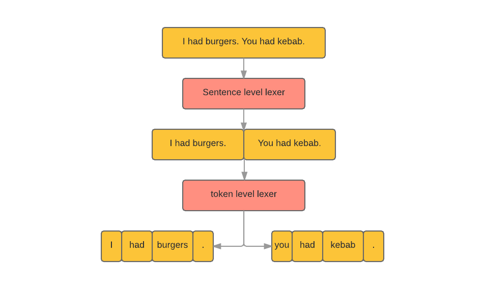

# Lexer

## What is lexing

Lexing is the process of separating a string of characters into different sections. The lexing library that **Fin** uses operates in two levels, first it tries to identify sentences and convert this string of text into an array of sentences, then on each sentence, it tries to identify tokens (words, punctuation ...etc) and convert a sentence into an array of token.

[](../images/lexer.png)

> __HINT__
> The lexer library is `~99%` compliant with the penn treebank corpus. Which makes it the best natural natural language processing lexer ever implemented in javascript.

So technically, the lexer is what converts a string of text into an array of sentences and further into an array of tokens.

## Example

```javascript

var input = "O'reilly Media (formerly O'reilly Associates), is a 49%-owned company. I didn't address any of the emails. Mr. T.J., an employee is at E!. He said: \"$4,000 was the profit.\" We met T.J. around 08:30 in the morning.";
// This is quite complex paragraph of text.
// We should learn a lot by running it through the lexer.

var processed = Fin.Run(input);

```

Let's see the lexing processing result:

* `processed.sentences.map(x=>x.sentence)`: logs an array of sentences
```javascript
[
	"O'reilly Media (formerly O'reilly Associates), is a 49%-owned company.",
	"I didn't address any of the emails.",
	"Mr. T.J., an employee is at E!.",
	"He said: \"$4,000 was the profit.\"",
	"We met T.J. around 08:30 in the morning."
]
```

* `processed.sentence.map(x=>x.tokens)`: logs the token level lexication result
```javascript
[
	["O'reilly","Media","(","formerly","O'reilly","Associates",")",",","is","a","49%-owned","company","."],
	["I","did","n't","address","any","of","the","emails","."],
	["Mr.","T.J.",",","an","employee","is","at","E!","."],
	["He","said",":","\"","$4,000","was","the","profit",".","\""],
	["We","met","T.J.","around","08:30","in","the","morning","."]
]
```


## How it works

### Separating sentences

The lexer identifies a sentence end by looking for punctuation marks that are usually found at the end of the sentence.

- **Full Stop**: `.`
- **Exclamation Mark**: `!`
- **Question Mark**: `?`
- **Ellipses**: `…` or `...`

The above punctuation marks are considered separators between tokens.

> __NOTE__
> The lexer actually does more than that, by seeing for example if the full stop punctuation mark came after an abbreviation like: `Morty Jr. had fun last night with Mr. Barney`. and it also detects those sentences where the full stop mark is included inside the parenthesis or the quotation like: `I felt I'm "losing my mind." It was obvious.`

### Separating tokens

- Every two words that are separated by space are considered two different tokens.
- Additionally, some words might have multiple tokens, so it needs to be separated for example:
	- opening parenthesis, e.g. `(something` and closing parenthesis `something)`.
	- punctuation marks that have no spaces between them and the previous word, e.g. `alex;`.
	English language contractions, e.g. `I'll` and `I'm`.
	- Symbols, e.g. `$33`.

So based on the above rules you'll get an array of tokens.

## Extensibility

As mentioned in the note above, the lexer takes in consideration the dot (`.`) that comes after an abbreviation like `Morty Jr. had a burger` so it doesn't consider it as a sentence stop.

This is based on a dictionary of common abbreviations. Although the dictionary includes about 160 common abbreviation (which should suffice for most of the use cases) but if you need to extend this dictionary you should do something like the following example:

```javascript
import {abbreviations} from "lexed";
abbreviations.push("mme"); // french abbreviation for Madame.
```

## Standalone usage

The lexer library can also be used as a standalone package:

```bash
npm i --save lexed
```

For more about the lexer library (i.e. **lexed**), refer to it's [readme.md](https://github.com/FinNLP/lexed/blob/master/readme.md).
