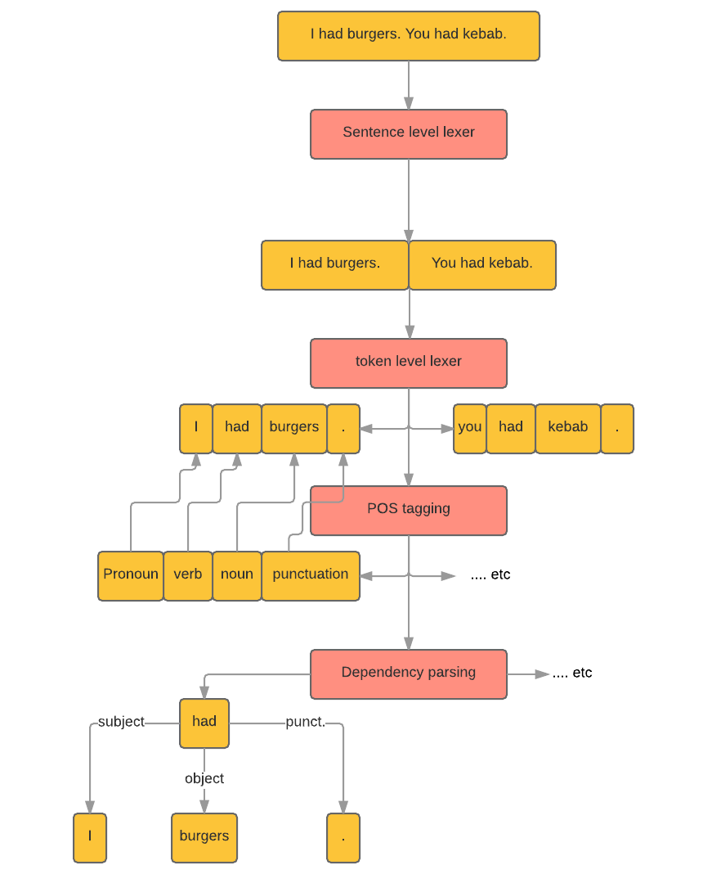

# Processing

## Introduction

When you pass a string to **Fin** it will go through a number of _processors_:
1. At first it will be intercepted by any interceptors you define.
2. Then it will be **lexed**: it will be split into sentences and further into tokens.
3. Then each token will be **POS tagged**: by annotating it with it's relevant part of speech annotation, like noun, verb ..etc.
4. Finally, each sentence will processed to resolve each token dependency.

The following chart explains each of the above steps with example:

[](../images/processing.png)

## Example

```javascript
const fin = require("finnlp");
let processed = new fin("I had burgers. you had kebab.");
// once a new instance of fin is created
// all of the above processing steps
// will be done
```

now running `console.log(processed)` will give you the following result:

```javascript
{
	"input":"I had burgers. you had kebab.",
	// an array of sentences
	"sentences":["I had burgers.","you had kebab."],
	// the result of processing each sentence
	"result":[
		{
			// raw input of the single sentence
			"raw":"I had burgers.",
			// an array of tokens
			"tokens":["I","had","burgers","."],
			// POS tags
			"tags":["PRP","VBD","NNS","."],
			// dependencies
			"deps":[
				{"label":"NSUBJ","type":"NP","parent":1},
				{"label":"ROOT","type":"VP","parent":-1},
				{"label":"DOBJ","type":"NP","parent":1},
				{"label":"PUNCT","type":"PUNCT","parent":1}
			],
			// a processing confidence score out of 100
			// 90 is the highest possible score
			"confidence":90
		},
		{
			"raw":"you had kebab.",
			"tokens":["you","had","kebab","."],
			"confidence":90,
			"tags":["PRP","VBD","NN","."],
			"deps":[
				{"label":"NSUBJ","type":"NP","parent":1},
				{"label":"ROOT","type":"VP","parent":-1},
				{"label":"DOBJ","type":"NP","parent":1},
				{"label":"PUNCT","type":"PUNCT","parent":1}
			]
		}
	]
}
```