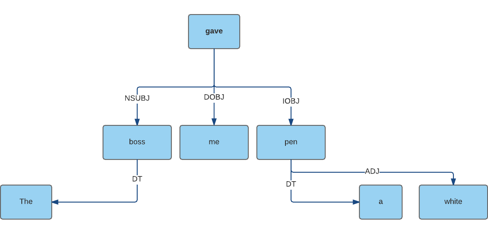

# Dependency Parser

## What is dependency parsing

> A natural language parser is a program that works out the grammatical structure of sentences, for instance, which groups of words go together (as "phrases") and which words are the subject or object of a verb. 
>
> - *Source: [Stanford Natural Language Processing Group](http://nlp.stanford.edu/software/lex-parser.shtml)*

Each sentence consists of multiple tokens, and those tokens are syntactically/grammatically dependent on each other. For example a sentence like this one: `I love you` have a nominal subject `I`, a direct object `you` and a verbal phrase `love`. So the verb `love` can be said to be a parent of `I` and `you`. 

The sentence `I love you` is an oversimplification of the real world cases. For example, if we had the sentence: `The boss gave me a white pen`, a visual representation of the dependency parsing result would be:

You can notice from the above chart that:

- `The` is a `determiner`, it's parent is `boss`.
- `Boss` is a `nominal subject`, it's parent is `gave`.
- `gave` is a `verbal phrase`, it has no parent (this it's the master of the sentence).
- `me` is a `direct object`, it's parent is `gave`.
- `a` is a `determiner`, it's parent is `pen`.
- `white` is an `adjective`, it's parent is `pen`.
- `pen` is an `indirect object`, it's parent is `gave`.

## Rules

- Sentence master has no parents.
- Sentence master is usually a verb that dictates the meaning of the sentence.
- A sentence can only have one master.
- A token can only have one parent.
- A token can have any number of children, or no children at all.

## Annotation Specifications

Each parent-child relationship has an annotation for it. Take the sentence above for example, `me` is a child of `gave` and the relationship between the two can be annotated as `DOBJ` which means **Direct Object**.

For a full list of the annotation specifications, refer to the **[Dependency Parsing Annotations Specifications](../specifications/dependency-parsing-annotations.html)** article. 

